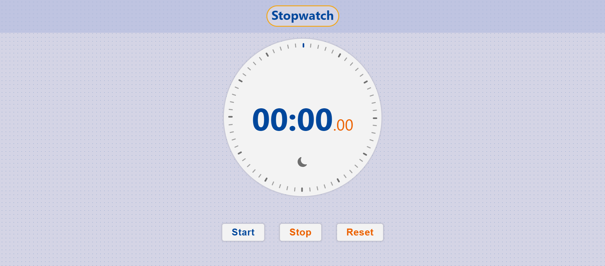

# Stopwatch

Welcome to my project! This application allows users to track time efficiently with a beautifully designed stopwatch interface.

## Live Demo

To see the project in action, check out the live version here: [Visit Live Website](https://guru-bandike.github.io/Stopwatch/).

## Features

- **Start/Stop**: Users can start and stop the timer with a simple click, allowing for precise time tracking.
- **Reset**: Resets the stopwatch to zero, ready for a new timing session.
- **Dark/Light Mode**: A toggle switch to change between dark and light themes, catering to user preference and reducing eye strain in different lighting conditions.
- **Visual Representation**: Each passing second is represented visually, providing an intuitive understanding of time elapsed.

## Technologies Used

- HTML5
- CSS3
- JavaScript

## Setup and Usage

To use the Stopwatch application, simply clone this repository to your local machine and open the `index.html` file in your web browser.

